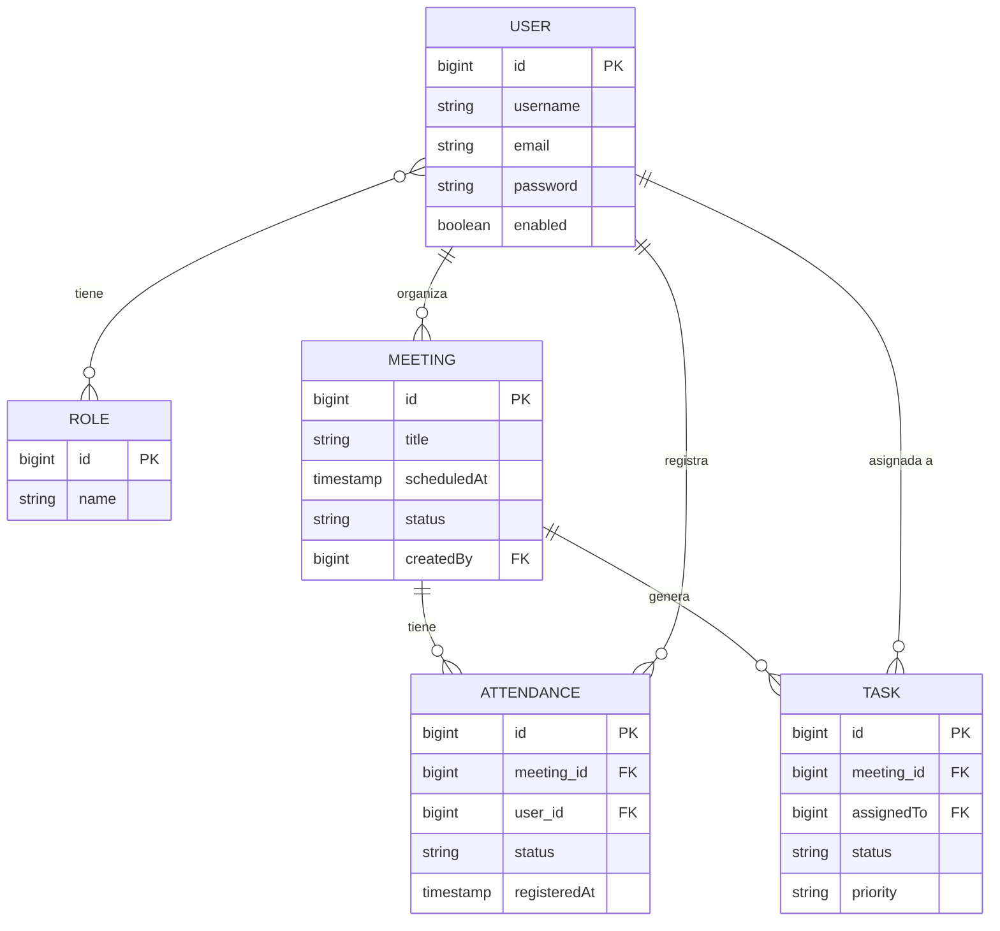
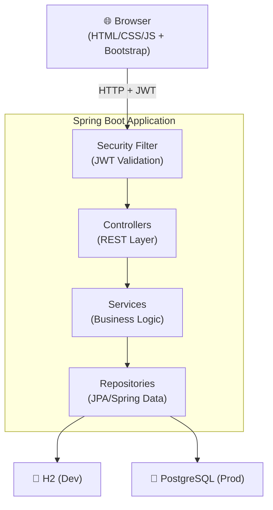

# PIC21 — Diseño Arquitectónico del Sistema

> **v1.1** — Ajustes aplicados: roles, permisos, estados de reunión, accessCode, validación de asistencia única

> Sistema de gestión de asistencias a reuniones educativas  
> Stack: Java + Spring Boot · H2/PostgreSQL · HTML/CSS/JS + Bootstrap · REST API

---

## 1. Estructura del Backend

```
pic21-backend/
├── src/main/java/com/pic21/
│   ├── Pic21Application.java          # Entry point
│   │
│   ├── config/                        # Configuración global
│   │   ├── SecurityConfig.java        # Spring Security + JWT
│   │   ├── CorsConfig.java
│   │   └── OpenApiConfig.java         # Swagger (opcional)
│   │
│   ├── domain/                        # Entidades JPA (capa de dominio)
│   │   ├── User.java
│   │   ├── Role.java
│   │   ├── Meeting.java
│   │   ├── Attendance.java
│   │   └── Task.java
│   │
│   ├── repository/                    # Interfaces JPA (acceso a datos)
│   │   ├── UserRepository.java
│   │   ├── RoleRepository.java
│   │   ├── MeetingRepository.java
│   │   ├── AttendanceRepository.java
│   │   └── TaskRepository.java
│   │
│   ├── service/                       # Lógica de negocio
│   │   ├── AuthService.java
│   │   ├── UserService.java
│   │   ├── MeetingService.java
│   │   ├── AttendanceService.java
│   │   └── TaskService.java
│   │
│   ├── controller/                    # Controladores REST
│   │   ├── AuthController.java
│   │   ├── UserController.java
│   │   ├── MeetingController.java
│   │   ├── AttendanceController.java
│   │   └── TaskController.java
│   │
│   ├── dto/                           # Objetos de transferencia de datos
│   │   ├── request/
│   │   │   ├── LoginRequest.java
│   │   │   ├── RegisterRequest.java
│   │   │   ├── MeetingRequest.java
│   │   │   ├── AttendanceRequest.java
│   │   │   └── TaskRequest.java
│   │   └── response/
│   │       ├── AuthResponse.java      # JWT token + datos básicos
│   │       ├── UserResponse.java
│   │       ├── MeetingResponse.java
│   │       ├── AttendanceResponse.java
│   │       └── TaskResponse.java
│   │
│   ├── security/                      # JWT y filtros
│   │   ├── JwtTokenProvider.java
│   │   ├── JwtAuthenticationFilter.java
│   │   └── UserDetailsServiceImpl.java
│   │
│   └── exception/                     # Manejo de errores
│       ├── GlobalExceptionHandler.java
│       ├── ResourceNotFoundException.java
│       └── UnauthorizedException.java
│
└── src/main/resources/
    ├── application.properties         # Config base (H2)
    ├── application-prod.properties    # Config producción (PostgreSQL)
    └── data.sql                       # Datos iniciales (roles, admin)
```

### Responsabilidades por capa

| Capa | Responsabilidad |
|---|---|
| **Controller** | Recibir HTTP, validar entrada, delegar al Service, retornar DTO |
| **Service** | Lógica de negocio, reglas, transacciones, mapeo entidad↔DTO |
| **Repository** | Queries JPA / JPQL, sin lógica de negocio |
| **Domain** | Modelado del dato, anotaciones JPA, relaciones |
| **DTO** | Contratos de API, serialización/deserialización, validaciones `@Valid` |
| **Security** | Filtros JWT, autorización por roles |

---

## 2. Entidades del Dominio

### `Role`
```
id          BIGINT PK
name        VARCHAR (ADMIN, PROFESOR, AYUDANTE, ESTUDIANTE)
description VARCHAR
```

### `User`
```
id          BIGINT PK
username    VARCHAR UNIQUE NOT NULL
email       VARCHAR UNIQUE NOT NULL
password    VARCHAR NOT NULL (bcrypt)
firstName   VARCHAR
lastName    VARCHAR
enabled     BOOLEAN DEFAULT true
createdAt   TIMESTAMP
roles       → ManyToMany → Role
```

### `Meeting`
```
id          BIGINT PK
title       VARCHAR NOT NULL
description TEXT
scheduledAt TIMESTAMP NOT NULL
location    VARCHAR
type        ENUM (PRESENCIAL, VIRTUAL, HIBRIDA)
status      ENUM (NO_INICIADA, ACTIVA, BLOQUEADA)
accessCode  VARCHAR (nullable, opcional)
createdBy   → ManyToOne → User (organizador)
attendances → OneToMany → Attendance
tasks       → OneToMany → Task
createdAt   TIMESTAMP
```

> ⚙️ **Regla de negocio**: solo se puede registrar asistencia cuando `status = ACTIVA`.

### `Attendance`
```
id            BIGINT PK
meeting       → ManyToOne → Meeting
user          → ManyToOne → User
status        ENUM (PRESENT, ABSENT, JUSTIFIED, LATE)
justification TEXT (nullable)
registeredAt  TIMESTAMP
registeredBy  → ManyToOne → User (quien la registró)
```

> 🔑 **Clave única compuesta**: `(meeting_id, user_id)` — **un usuario no puede registrarse dos veces en la misma reunión** (validado a nivel DB y servicio).
> ⚙️ **Regla de negocio**: si `registeredBy == user`, es auto-registro del ESTUDIANTE; si difieren, fue registrado por PROFESOR/AYUDANTE/ADMIN.

### `Task`
```
id          BIGINT PK
meeting     → ManyToOne → Meeting
title       VARCHAR NOT NULL
description TEXT
assignedTo  → ManyToOne → User
dueDate     DATE
status      ENUM (PENDING, IN_PROGRESS, DONE, CANCELLED)
priority    ENUM (LOW, MEDIUM, HIGH)
createdBy   → ManyToOne → User
createdAt   TIMESTAMP
updatedAt   TIMESTAMP
```

---

## 3. Diagrama de Relaciones



---

## 4. Flujo de Autenticación y Roles

### Autenticación JWT

```
1. Cliente → POST /api/auth/login  { username, password }
2. AuthController → AuthService → validar credenciales con UserDetailsService
3. Spring Security verifica contraseña (BCrypt)
4. Si OK → JwtTokenProvider genera token firmado (HS256, exp: 8h)
5. Respuesta → { token, refreshToken, user: { id, roles, name } }
6. Cliente guarda el token (localStorage / sessionStorage)
7. Cada request posterior → Header: Authorization: Bearer <token>
8. JwtAuthenticationFilter intercepta → valida firma + expiración
9. Carga SecurityContext con usuario y sus roles
10. Spring Security evalúa autorización por endpoint
```

### Roles y Permisos

> PROFESOR y AYUDANTE tienen **exactamente los mismos permisos**.

| Acción | ADMIN | PROFESOR | AYUDANTE | ESTUDIANTE |
|---|:---:|:---:|:---:|:---:|
| Gestionar usuarios | ✅ | ❌ | ❌ | ❌ |
| Crear reuniones | ✅ | ✅ | ✅ | ❌ |
| Ver todas las reuniones | ✅ | ✅ | ✅ | ✅ |
| Registrar asistencia de otros | ✅ | ✅ | ✅ | ❌ |
| Registrar propia asistencia | ✅ | ✅ | ✅ | ✅ ✱ |
| Ver propias asistencias | ✅ | ✅ | ✅ | ✅ |
| Crear/asignar tareas | ✅ | ✅ | ✅ | ❌ |
| Completar tarea asignada | ✅ | ✅ | ✅ | ✅ |
| Exportar reportes | ✅ | ✅ | ✅ | ❌ |
| Cambiar estado de reunión | ✅ | ✅ | ✅ | ❌ |

> ✱ ESTUDIANTE solo puede registrar **su propia** asistencia y **únicamente cuando la reunión está ACTIVA**.

---

## 5. Endpoints REST

### Auth — `/api/auth`

| Método | Endpoint | Acceso | Descripción |
|---|---|---|---|
| POST | `/login` | Público | Login, retorna JWT |
| POST | `/register` | ADMIN | Crear usuario |
| POST | `/refresh` | Autenticado | Renovar token |
| POST | `/logout` | Autenticado | Invalidar token (blacklist) |

### Users — `/api/users`

| Método | Endpoint | Acceso | Descripción |
|---|---|---|---|
| GET | `/` | ADMIN | Listar todos los usuarios |
| GET | `/{id}` | ADMIN / propio | Ver perfil |
| PUT | `/{id}` | ADMIN / propio | Actualizar perfil |
| DELETE | `/{id}` | ADMIN | Eliminar usuario |
| PUT | `/{id}/toggle` | ADMIN | Activar/desactivar |
| GET | `/{id}/attendances` | ADMIN / COORDINATOR | Historial de asistencias |

### Meetings — `/api/meetings`

| Método | Endpoint | Acceso | Descripción |
|---|---|---|---|
| GET | `/` | Autenticado | Listar reuniones (paginado) |
| GET | `/{id}` | Autenticado | Detalle de reunión |
| POST | `/` | ADMIN / PROFESOR / AYUDANTE | Crear reunión |
| PUT | `/{id}` | ADMIN / PROFESOR / AYUDANTE | Actualizar reunión |
| DELETE | `/{id}` | ADMIN | Eliminar reunión |
| PATCH | `/{id}/status` | ADMIN / PROFESOR / AYUDANTE | Cambiar estado (NO_INICIADA → ACTIVA → BLOQUEADA) |

### Attendances — `/api/attendances`

| Método | Endpoint | Acceso | Descripción |
|---|---|---|---|
| GET | `/meeting/{meetingId}` | ADMIN / PROFESOR / AYUDANTE | Lista de asistencia por reunión |
| POST | `/meeting/{meetingId}` | ADMIN / PROFESOR / AYUDANTE | Registrar asistencias de otros en lote |
| POST | `/meeting/{meetingId}/self` | Autenticado | Auto-registro (propio) — solo si reunión ACTIVA |
| PUT | `/{id}` | ADMIN / PROFESOR / AYUDANTE | Modificar asistencia |
| GET | `/user/{userId}` | ADMIN / propio | Historial de un usuario |
| GET | `/meeting/{meetingId}/report` | ADMIN / PROFESOR / AYUDANTE | Exportar reporte |

> ⚙️ Toda escritura en `/attendances` valida: (1) reunión en estado **ACTIVA**, (2) unicidad `(meeting_id, user_id)`.

### Tasks — `/api/tasks`

| Método | Endpoint | Acceso | Descripción |
|---|---|---|---|
| GET | `/meeting/{meetingId}` | Autenticado | Tareas de una reunión |
| GET | `/my` | Autenticado | Mis tareas asignadas |
| POST | `/meeting/{meetingId}` | ADMIN / COORDINATOR / TEACHER | Crear tarea |
| PUT | `/{id}` | ADMIN / COORDINATOR / TEACHER | Actualizar tarea |
| PATCH | `/{id}/status` | Asignado / ADMIN | Cambiar estado |
| DELETE | `/{id}` | ADMIN / creador | Eliminar tarea |

---

## 6. Buenas Prácticas de Seguridad

### Autenticación y Tokens
- **BCrypt** con factor de costo ≥ 12 para hashear contraseñas
- **JWT firmado** con clave secreta en variable de entorno (no en código)
- Tokens de **corta duración** (8h acceso, 7d refresh)
- Implementar **blacklist de tokens** al hacer logout (usando Redis o tabla DB)
- Refresh token rotante: emitir nuevo refresh en cada renovación

### Autorización
- `@PreAuthorize` con SpEL a nivel de método para control granular
- Verificar que el usuario solo puede acceder/modificar **sus propios recursos** (no solo por rol, sino por ownership)
- Validar roles tanto en endpoints como en la capa de servicio

### Validación y Datos
- Usar `@Valid` + Bean Validation en todos los DTOs de entrada
- **Nunca** exponer entidades JPA directamente como respuesta (usar DTOs)
- Nunca loguear contraseñas, tokens ni datos sensibles
- Sanitizar inputs para prevenir inyecciones

### Configuración y Exposición
- Configurar **CORS** restrictivo (solo orígenes permitidos)
- Deshabilitar endpoints de H2 Console en producción
- Usar `application-prod.properties` para credenciales de BD (via variables de entorno)
- Definir un `GlobalExceptionHandler` que nunca exponga stack traces al cliente
- Headers de seguridad HTTP: `X-Content-Type-Options`, `X-Frame-Options`, `Content-Security-Policy`

### Base de Datos
- Usar **contraseñas fuertes** para PostgreSQL en producción
- **No usar** `spring.jpa.hibernate.ddl-auto=create-drop` en producción (usar Flyway/Liquibase)
- Separar credenciales de DB por entorno

---

## Diagrama de Arquitectura General


